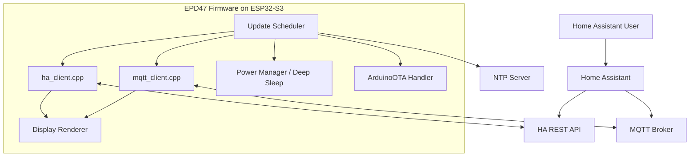
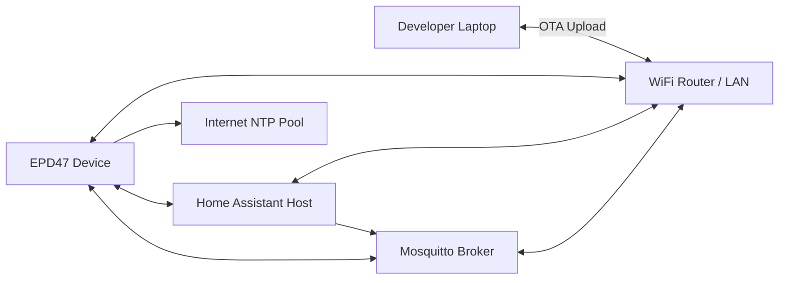
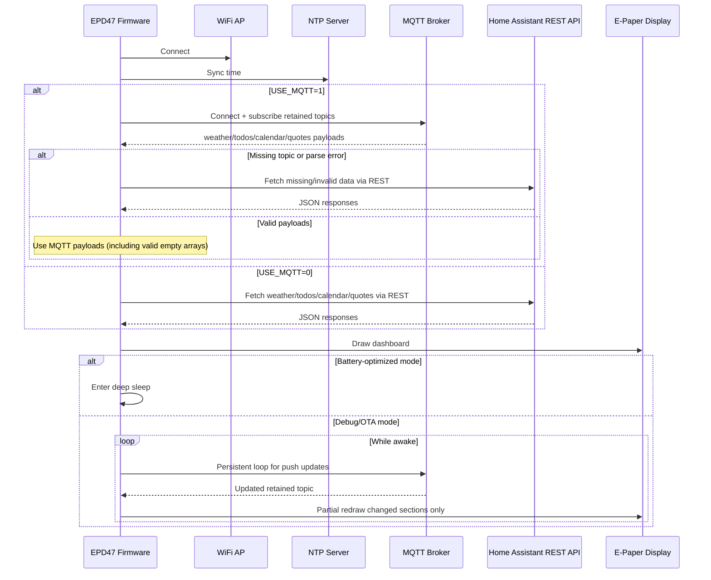

## Home Assistant Dashboard for LilyGo EPD47

A low-power e-paper dashboard for the 4.7" T5-Epaper-S3, showing Home Assistant data with minimal refreshes.

### Features

- **Top bar:** Date (left), WiFi indicator, Weather (right). Clock removed to save refreshes.
- **Quotes:** Rotated every 6 hours from a Home Assistant sensor.
- **Todos & Calendar:** Tasks due today and next 7 days of events.
- **Mini Calendar:** Compact week view with today highlighted.
- **On-demand OTA:** Press the user button (GPIO21) to enable a 5-minute OTA window; WiFi stays off otherwise.

### Update / Refresh cadence

- Weather: hourly
- Todo & Calendar: every 6 hours
- Quotes: rotate every 6 hours; fetch new once per day
- Full refresh: once at midnight (00:00)
- WiFi: turned off after each fetch unless OTA window is active

### Hardware Requirements

- **Board**: LilyGo T5-ePaper-S3 (ESP32-S3, 4.7" EPD, 960x540)
- **Framework**: Arduino/PlatformIO
- **PSRAM**: Required (OPI PSRAM)

### Project Structure

```
LilyGo-EPD47/
├── .platformio_env          # OTA config (NOT in git) - create from .platformio_env.example
├── .platformio_env.example  # Template for .platformio_env
├── extra_scripts/
│   └── load_env.py          # Script to load .platformio_env for OTA
├── platformio.ini           # PlatformIO configuration
└── examples/ha_calendar/
    ├── ha_calendar.ino      # Main firmware
    ├── secrets.h             # Your credentials (NOT in git)
    ├── secrets.example.h    # Template for secrets.h
    ├── config.h             # Your entity IDs and timezone (NOT in git)
    ├── config.example.h     # Template for config.h
    ├── weather_icons.h      # Weather condition icons
    ├── todo_icons.h         # Todo list icons
    ├── calendar_icons.h     # Calendar icons
    └── wifi_icons.h         # WiFi status icons
```

### Setup Instructions

#### 1. Install Dependencies

This project uses PlatformIO. Install PlatformIO IDE or CLI, then:

```bash
cd /path/to/LilyGo-EPD47
pio lib install
```

#### 2. Configure Secrets

Create `secrets.h` from the template:

```bash
cp examples/ha_calendar/secrets.example.h examples/ha_calendar/secrets.h
```

Edit `secrets.h` with your credentials:

```cpp
#pragma once

// WiFi credentials
#define WIFI_SSID      "YOUR_WIFI_SSID"
#define WIFI_PASSWORD  "YOUR_WIFI_PASSWORD"

// Home Assistant
#define HA_HOST_ADDR   "192.168.1.100"  // Your HA IP or "homeassistant.local"
#define HA_PORT_NUM    8123

// Long-lived access token from Home Assistant
#define HA_TOKEN_VALUE "YOUR_LONG_LIVED_TOKEN_HERE"
```

**Important**: `secrets.h` is in `.gitignore` and will NOT be committed to git.

#### 3. Configure Entities and Timezone

Create `config.h` from the template:

```bash
cp examples/ha_calendar/config.example.h examples/ha_calendar/config.h
```

Edit `config.h` with your Home Assistant entity IDs and timezone:

```cpp
#pragma once

// Weather entity
#define ENTITY_WEATHER "weather.your_weather_entity"

// Quote sensor (optional)
#define ENTITY_QUOTE "sensor.quote_of_the_day"

// Todo entities
#define ENTITY_TODOS_COUNT 2
#define ENTITY_TODO_1 "todo.your_todo_1"
#define ENTITY_TODO_2 "todo.your_todo_2"

// Calendar entities
#define ENTITY_CALENDARS_COUNT 2
#define ENTITY_CALENDAR_1 "calendar.your_calendar_1"
#define ENTITY_CALENDAR_2 "calendar.your_calendar_2"

// NTP Timezone Configuration
#define NTP_SERVER "pool.ntp.org"
#define GMT_OFFSET_SEC -18000   // UTC-5 (EST). Adjust for your timezone
#define DAYLIGHT_OFFSET_SEC 3600 // 1 hour for DST
```

**Important**: `config.h` is in `.gitignore` and will NOT be committed to git. This keeps your personal entity IDs private.

#### 4. Configure OTA Updates (Optional but Recommended)

To enable Over-The-Air (OTA) updates, create a `.platformio_env` file in the project root:

```bash
cp .platformio_env.example .platformio_env
```

Edit `.platformio_env` with your device's IP address and OTA password:

```bash
# PlatformIO Environment Variables
# This file is NOT tracked by git - create your own from .platformio_env.example

# OTA Upload Configuration
OTA_IP=192.168.1.100  # Your device's IP address (will be set after first USB upload)
OTA_PASSWORD=epd47ota  # OTA password (must match ArduinoOTA.setPassword() in ha_calendar.ino)
```

**Important**: `.platformio_env` is in `.gitignore` and will NOT be committed to git. This keeps your IP address and OTA password private.

**Note**: The default OTA password is `epd47ota`. Change it in `ha_calendar.ino` and update `.platformio_env` accordingly.

OTA usage in low-power mode:

- After boot, OTA is enabled for a short window (5 minutes)
- To re-enable OTA later, press the user button (GPIO21). This opens another 5-minute OTA window
- Outside the OTA window, WiFi stays off to save battery

#### 5. Build and Upload

**First upload (via USB):**
```bash
pio run -e T5-ePaper-S3 -t upload
```

**Monitor serial output:**
```bash
pio device monitor
```

Look for the IP address in the serial output (e.g., `IP address: 192.168.1.100`)

**Update `.platformio_env`** with the IP address you see in the serial monitor.

#### 6. Upload Over WiFi (OTA)

After configuring `.platformio_env`, you can update firmware over WiFi without a USB cable:

```bash
pio run -e T5-ePaper-S3-OTA -t upload
```

The script `extra_scripts/load_env.py` automatically loads your IP and password from `.platformio_env`.

### MQTT Automations

If you want the firmware to read Home Assistant state from retained MQTT topics instead of REST polling:

1. Enable `USE_MQTT` in `examples/ha_calendar/config.h`.
2. Use `bash scripts/create_ha_automation.sh` to print the paste-ready YAML.
3. Or run `python3 scripts/create_ha_automations.py --yaml` directly if you want the same output without the shell wrapper.
4. Copy the generated automations from `examples/ha_calendar/HA-MQTT-AUTOMATIONS.yaml` if you prefer a static reference.

#### MQTT Payload Notes

- `weather`: expected object, e.g. `{"state":"partlycloudy","temperature":22.5}`
- `todos`: expected array of todo items
- `quotes`: expected array of quote entries
- `calendar`: supports both payload styles for `start`:
  - string style: `{"summary":"Meeting","start":"2026-06-01T09:00:00"}`
  - nested style: `{"summary":"Meeting","start":{"dateTime":"2026-06-01T09:00:00"}}`
  - all-day nested style: `{"summary":"Holiday","start":{"date":"2026-06-01"}}`

### Architecture Diagram



### Network Diagram



### Sequence Diagram



### Home Assistant Setup

#### Quote Sensor (Optional)

Create a sensor in Home Assistant to provide daily quotes:

```yaml
sensor:
  - platform: template
    sensors:
      quote_of_the_day:
        friendly_name: "Quote of the Day"
        value_template: "{{ states('sensor.quote_text') }}"
        attributes:
          quotes:
            - text: "Quote 1 text"
              author: "Author 1"
            - text: "Quote 2 text"
              author: "Author 2"
```

The firmware reads the `quotes` attribute and rotates through them every 3 hours.

### Display Layout

```
┌─────────────────────────────────────────┐
│  Time WiFi Bat Weather    Date         │  ← Top bar
│                                         │
│  Daily Motivational Quote              │  ← Quote section
│  ─────────────────────────────────────  │
│  TODO              UPCOMING            │
│  ✓ Task 1         1/15 9:30           │
│  > Task 2           Event Title        │
│  > Task 3         1/16 14:00           │
│                      Another Event     │
│  ─────────────────────────────────────  │
│  S  M  T  W  T  F  S                   │  ← Mini calendar
│  14 15 16 17 18 19 20                  │
└─────────────────────────────────────────┘
```

### Update Intervals

- **Clock**: Every 1 minute
- **Date**: Once per day (at midnight)
- **Weather**: Every 1 hour
- **Todo & Calendar**: Every 1 hour
- **Quotes**: Rotated every 3 hours, fetched once per day
- **Battery**: Every 1 minute

### Partial Refresh

The firmware uses partial screen updates for:
- Faster updates
- Minimal flashing
- Lower power consumption
- Reduced ghosting

Only changed sections are redrawn (e.g., clock updates don't refresh the entire screen).

### Troubleshooting

**WiFi not connecting:**
- Check `secrets.h` credentials
- Verify WiFi network is 2.4GHz (ESP32 doesn't support 5GHz)

**No data displayed:**
- Check serial monitor for API errors
- Verify Home Assistant entity IDs are correct
- Ensure HA token has proper permissions
- Check HA is accessible from device's network

**OTA upload fails:**
- Verify device IP address is correct in `.platformio_env` (check serial monitor)
- Check OTA password matches in code (`ha_calendar.ino`) and `.platformio_env`
- Ensure `.platformio_env` file exists and is properly formatted (no extra spaces around `=`)
- Ensure device is on the same WiFi network
- Try USB upload first to ensure device is working
- Check that `extra_scripts/load_env.py` is loading values (look for "Loaded: OTA_IP" in build output)

**Display issues:**
- Check serial monitor for errors
- Verify PSRAM is enabled in board settings
- Ensure display is properly connected

**Battery not showing or incorrect:**
- Ensure battery is properly connected to the board
- Check serial monitor for battery voltage readings (look for "Battery: X.XXV (XX%)")
- Battery reading requires `epd_poweron()` - the display must be powered when reading
- If battery shows 0% or very low, check battery voltage with a multimeter
- Charging detection is based on voltage threshold (≥4.15V) - may not be 100% accurate
- Battery percentage calculation: 3.0V = 0%, 4.2V = 100% (typical LiPo range)

**Power Management:**
- **Battery Operation**: The board automatically runs on battery when USB-C is disconnected
- **USB-C Charging**: When USB-C is connected, the board automatically:
  - Switches to USB power (no interruption)
  - Charges the battery (if connected)
  - Continues normal operation
- **Display Power**: The display is powered on only when updating (saves battery)
- **No Manual Switching**: Power source switching is automatic - no code changes needed

### Security Notes

- **Never commit `secrets.h`** - It contains your WiFi password and HA token
- **Never commit `config.h`** - It contains your personal entity IDs
- **Never commit `.platformio_env`** - It contains your device IP and OTA password
- **Change OTA password** - Default is `epd47ota`, change it for security
- **Use long-lived tokens** - Create a token in HA with minimal required permissions
- **Keep firmware updated** - OTA makes it easy to push security updates

### License

This firmware is part of the LilyGo EPD47 project. See main repository LICENSE file.
